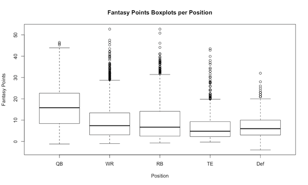
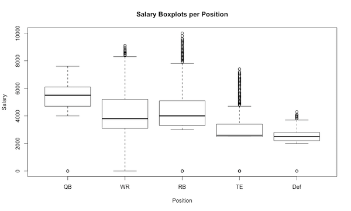
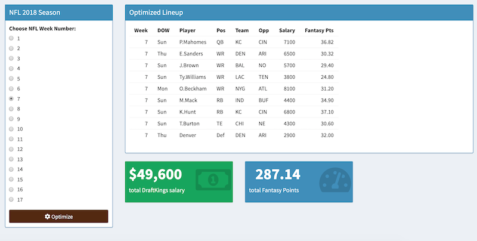

# NFL Daily Fantasy Optimzer 
### Final Project - UCLA Stats 418: Tools in Data Science (Spring 2019)
### Link to Shiny App - [NFL DFS](https://guydotan.shinyapps.io/nfl_dfs/)

## Background
This app is an optimizer for the daily fantasy sports competitions that have become increasingly popular over the past 10 years. Whereas in regular season-long fantasy sports a manager drafts his or her team and follows that roster for the remainder of the season, in daily fantasy a new team is selected daily (or weekly in the NFL).

The current iteration of this product is built to determine the best possible lineup based on the [DraftKings](http://www.draftkings.com) scoring settings. Using a simple optimization technique it will output what would have been the top lineup each week of the 2018 NFL fantasy regular season.

## Exploratory Data Analysis

Our data comes from two locations:

 1. [nfscrapR](https://github.com/maksimhorowitz/nflscrapR/) - R package built on the NFL API play-by-play data to aggregate 2018 individual player statistics and then converted to DraftKings fantasy points.
 2. [RotoGuru](http://rotoguru1.com/cgi-bin/fyday.pl?week=17&game=dk/) - Archive of daily fantasy salaries and points from a variety of DFS sites that was scraped using R’s `rvest` package.

Once the two datasets had been merged and cleaned the final working dataset had the following player breakdown:

**Number of Draftable Players per Week by Position**

| Week | QB |  WR | RB | TE | Def |
|-----:|---:|----:|---:|---:|----:|
|    1 | 36 | 115 | 85 | 56 |  32 |
|    2 | 36 | 118 | 88 | 58 |  32 |
|    3 | 37 | 121 | 87 | 59 |  32 |
|    4 | 36 | 118 | 76 | 56 |  30 |
|    5 | 35 | 120 | 74 | 53 |  30 |
|    6 | 32 | 113 | 77 | 53 |  30 |
|    7 | 34 | 107 | 70 | 45 |  28 |
|    8 | 34 | 106 | 75 | 46 |  28 |
|    9 | 31 | 101 | 67 | 41 |  26 |
|   10 | 33 | 103 | 81 | 56 |  28 |
|   11 | 33 |  97 | 67 | 51 |  26 |
|   12 | 35 | 113 | 78 | 58 |  30 |
|   13 | 37 | 119 | 82 | 52 |  32 |
|   14 | 40 | 122 | 89 | 53 |  32 |
|   15 | 35 | 119 | 84 | 56 |  32 |
|   16 | 41 | 122 | 78 | 54 |  32 |
|   17 | 40 | 120 | 90 | 52 |  32 |

Fantasy points range from a highest single week total of 52.70 points (Christian McCaffrey, Car - Wk 12 and Amari Cooper, Dal - Wk 14) to a lowest total of -4.00 points (Team defenses a handful of times).

Salary ranges from a highest single week total of &#36;10,000 (Todd Gurley, LA - Wk 6) to a low of &#36;0 which is most likely due to missing values in RotoGuru's site. Therefore the lowest non-zero total is &#36;2,000 (dozens of times).

To conduct more exploratory data analysis use the interactive visualization on the **Explore** tab of the Shiny app. There you can filter through and play around with the football statistics, salaries, fantasy points, and more.

## Methdology 

### Daily Fantasy Rules

For the purposes of this app, we will be looking at the "NFL Classic" scoring system and structure in DraftKings' NFL daily fantasy competitions. The goal in DFS is to assemble a lineup of players within a certain salary cap. NFL players generate fantasy points based on their performance in the real games that week and the lineups with the most points are awarded prizes. 

Each lineup can have a maximum salary of &#36;50,000. The salary of a player is determined by DraftKings before the first game of the week. A lineup consists of 9 positions:

* 1 QB
* 3 WR
* 2 RB
* 1 TE
* 1 Flex (WR/RB/TE)
* 1 Def

Fantasy points are calculated according to the following scoring system per [DraftKings](https://www.draftkings.com/help/rules/1/1) rules. 

**Fantasy Points Scoring System**

|                Offense                |                          |               Defense              |         |
|:-------------------------------------:|:------------------------:|:----------------------------------:|---------|
| Passing TD                            | +4 Pts                   | Sack                               | +1 Pt   |
| 25 Passing Yards                      | +1 Pt (+0.04 Pts/ Yards) | Interception                       | +2 Pts  |
| 300+ Yard Passing Game                | +3 Pts                   | Fumble Recovery                    | +2 Pts  |
| Interception                          | -1 Pt                    | Punt/Kickoff/FG Return for TD      | +6 Pts  |
| Rushing TD                            | +6 Pts                   | Interception Return TD             | +6 Pts  |
| 10 Rushing Yards                      | +1 Pt (+0.1 Pts/Yard)    | Fumble Recovery TD                 | +6 Pts  |
| 100+ Yard Rushing Game                | +3 Pts                   | Blocked Punt or FG Return TD       | +6 Pts  |
| Receiving TD                          | +6 Pts                   | Safety                             | +2 Pts  |
| 10 Receiving Yards                    | +1 Pt (+0.1 Pts/Yard)    | Blocked Kick                       | +2 Pts  |
| 100+ Receiving Yard Game              | +3 Pts                   | 2 Pt Conversion/Extra Point Return | +2 Pts  |
| Reception                             | +1 Pt                    | 0 Points Allowed                   | +10 Pts |
| Punt/Kickoff/FG Return for TD         | +6 Pts                   | 1 – 6 Points Allowed               | +7 Pts  |
| Fumble Lost                           | -1 Pt                    | 7 – 13 Points Allowed              | +4 Pts  |
| 2 Pt Conversion (Pass, Run, or Catch) | +2 Pts                   | 14 – 20 Points Allowed             | +1 Pt   |
| Offensive Fumble Recovery TD          | +6 Pts                   | 21 – 27 Points Allowed             | +0 Pts  |
|                                       |                          | 28 – 34 Points Allowed             | -1 Pt   |
|                                       |                          | 35+ Points Allowed                 | -4 Pts  |

### The Optimizer 

The optimizer was built using R's linear optimization package called `lpSolve`. Basically it takes the tenants of the combinatorial optimization problem in mathematics called the [Knapsack Problem](https://en.wikipedia.org/wiki/Knapsack_problem).

I used the following [Optimizer on GitHub](https://github.com/sdeep27/linear-optimization-fantasy-football) to solve the lineup optimization. The function takes in the following inputs: a dataset, a maxmimum salary constraint, and an optimization value (fantasy points). It then outputs the optimal 9-position lineup as the corresponding salaries and fantasy points.

## Results

The **Optimizer** tab in the Shiny app has the results of the lineup optimization for each of the 17 weeks of the 2018 NFL season. Simply just select the week you want the best lineup for and click the "Optimize" button. The total salary and total fantasy points for that lineup will display in the green and blue boxes, respectively.

---

**Copyright:** Guy Dotan, UCLA MAS 2019

**Last Updated:** 06/10/2019
